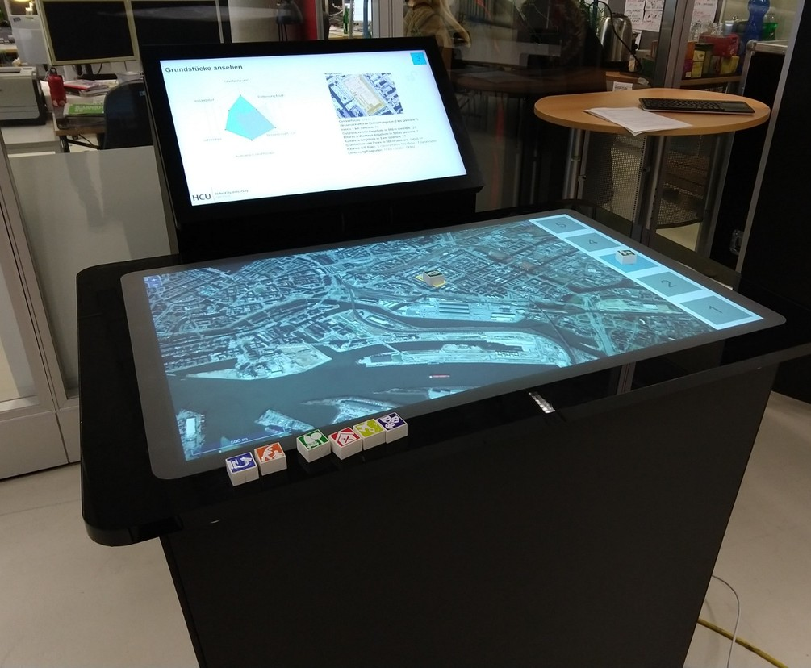

# LocationFinder

The LocationFinder is an evidence-based tool to assist decision makers in finding a plot most suitable for a given urban development project.

It is intended to run on a two-screen setup, one of which is a table-like multitouch device. Tangible objects may be used to interact with the application if the touch device supports the [TUIO protocol](https://www.tuio.org/).


[Clicke here](https://drive.google.com/file/d/141apkj1dzWFv66yw5TxGTTFjRqDRpflZ/view?usp=sharing) if the video doesn't load.




## Installing

```
npm install
```

## Running

```
npm start
```

This will start a development server on `http://localhost:4200/`.

Two browser windows need to be opened in separate windows:
- `http://localhost:4200/#/` on the multi-touch table
- `http://localhost:4200/#/infoscreen` on the separate screen


## Configuration

Copy the configuration template from `src/app/config-dist.json` to `src/app/config.json` and adjust it to your needs.

[Configuration reference](doc/configuration.md)

## Authors

Jan Behrens, Nina Pohler, Holger Prang (CityScienceLab @ HafenCity University Hamburg)
